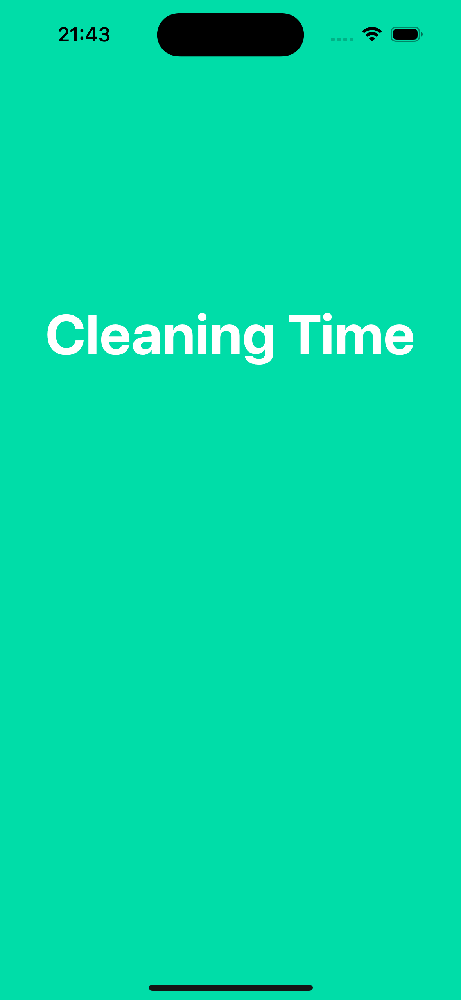
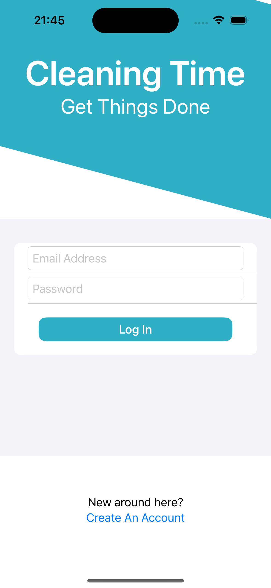
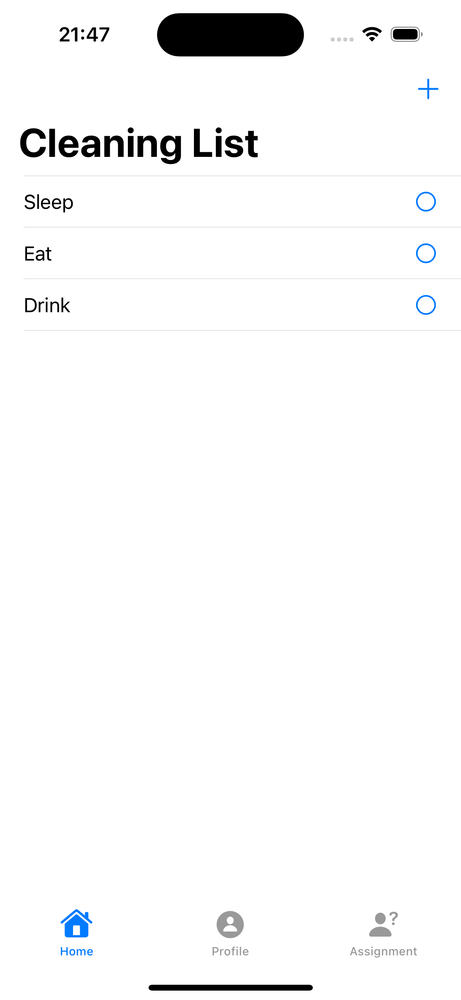
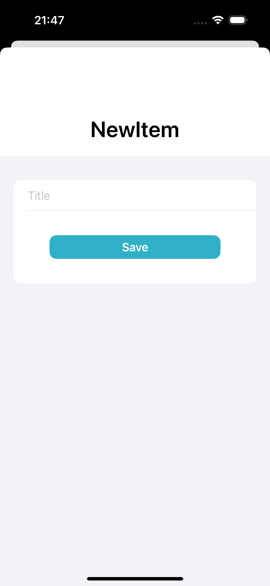
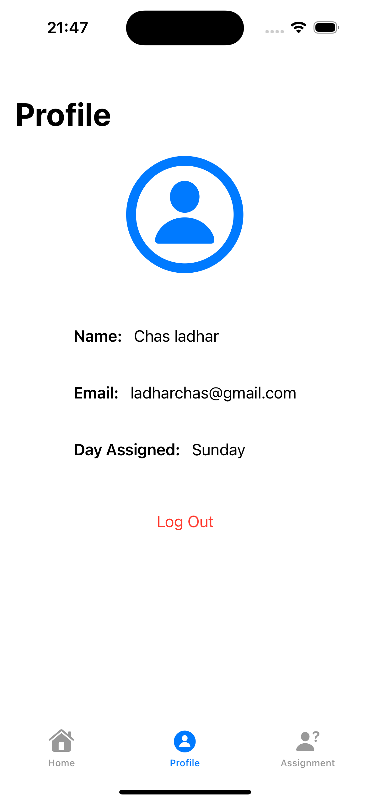
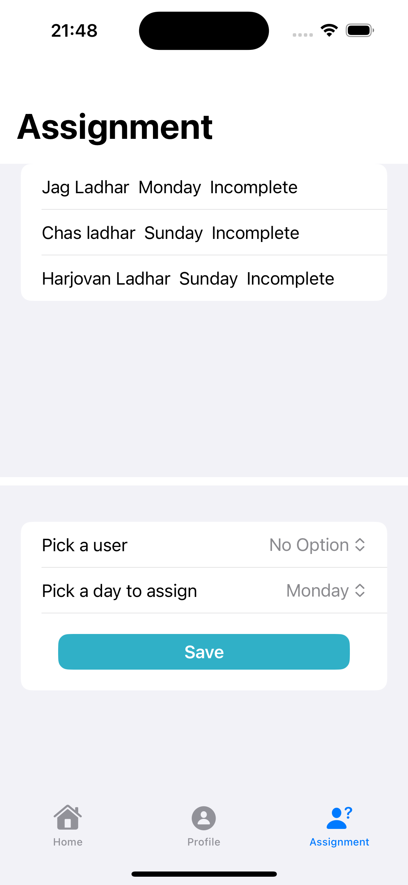

# Cleaning Time

IOS app to help manage cleaning my flat. Each flatmate can be assigned a day to clean. All tasks on the checklist must be ticked in order for their day to be classed
as 'complete'. As I am an admin user, I can create and delete tasks at any point, view and monitor who has or hasn't cleaned on their assigned days within the past
week, as well as change the days assigned to each user. Users will recieve push notifications on their phone when it is their day to clean.

Two scheduled google cloud functions are running for this app: 
- Every Monday at 12AM to set the 'completed' key for each document in the "users" collection to false
- Every day at 12AM to set the 'isDone' key for each document in the "todos" collection to false

Happy cleaning!

